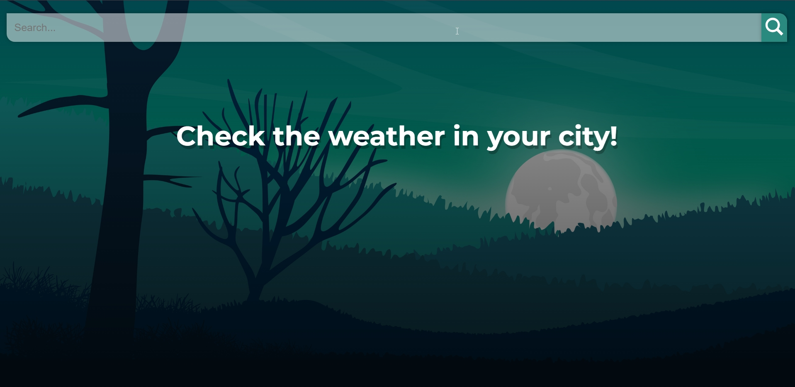
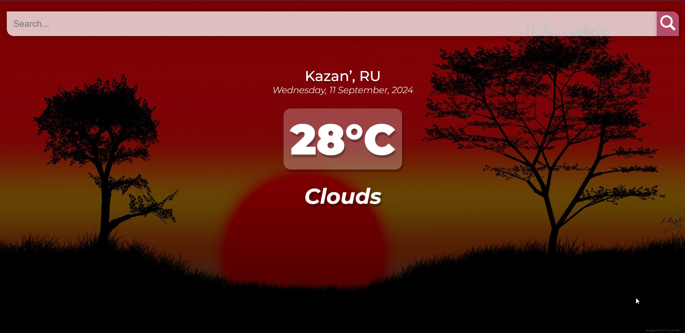
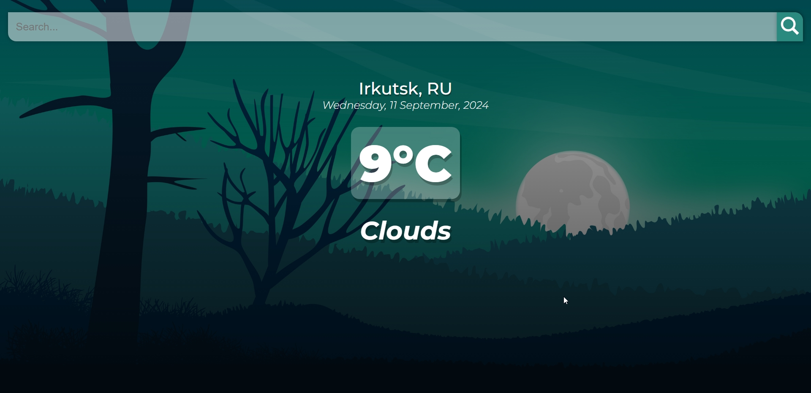
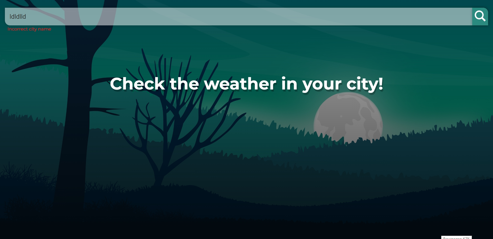
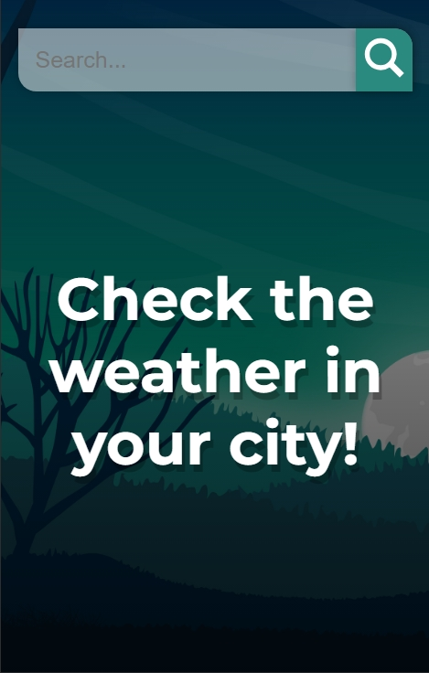
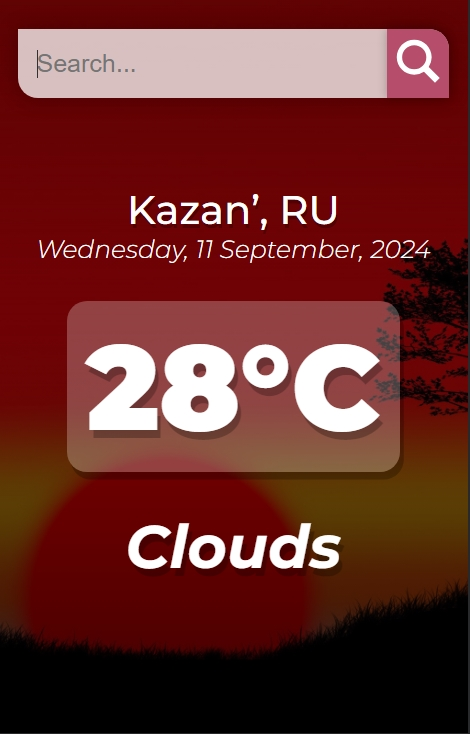
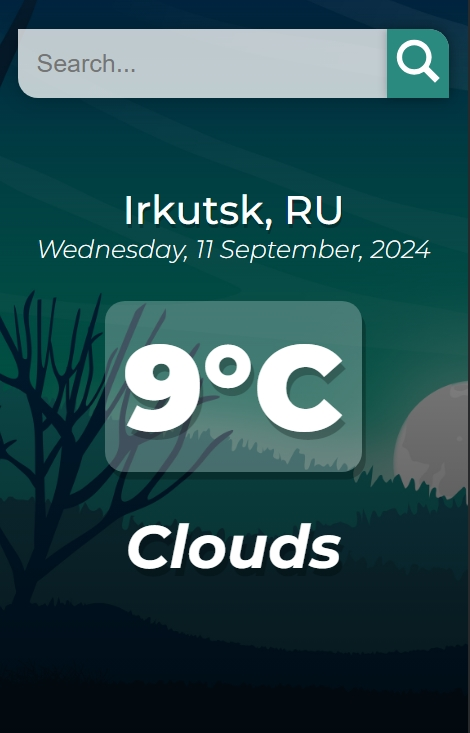
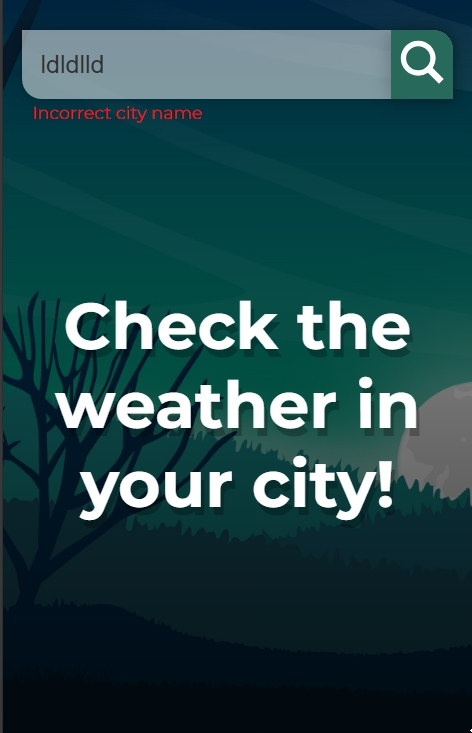

# Weather Search Application 🔆

This is a simple weather search application that allows users to input a city name and receive the current weather conditions for that location. The user interface is designed with a responsive layout and includes a search bar, error messages for invalid inputs, and a visual display of the weather data.

## Demo 🌐
You can try the Weather Search Application online [here](https://afkeomre.github.io/weather/).

## Features ✔️

- **Search Functionality**: the app allows users to enter the name of a city to search for current weather conditions.
- **Weather Display**: displays the current temperature, weather conditions, location, and date.
- **Error Handling**: shows an error message if the search input is invalid or if the location cannot be found.
- **Dynamic Themes**: the website automatically changes the background image and button color based on the temperature. There are two themes: a "cold" theme for low temperatures and a "warm" theme for higher temperatures.
- **Responsive Design**: the layout adjusts to different screen sizes, ensuring a smooth user experience on both desktop and mobile devices.

## Preview 👀

### Desktop 🖥️

|  |  |
|:--:|:--:|
| Main screen | Warm theme |

|  |  |
|:--:|:--:|
| Cold theme | Error message |


### Mobile devices 📱
|  |  |  |  |
|:--:|:--:|:--:|:--:|
| Main screen | Warm theme | Cold theme | Error message |

## Project setup ⚙️
```
npm install
```

### Compiles and hot-reloads for development
```
npm run serve
```

### Compiles and minifies for production
```
npm run build
```

### Customize configuration
See [Configuration Reference](https://cli.vuejs.org/config/).
