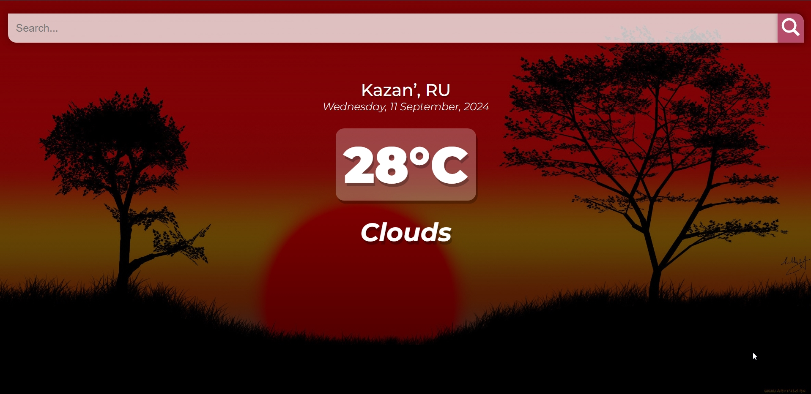
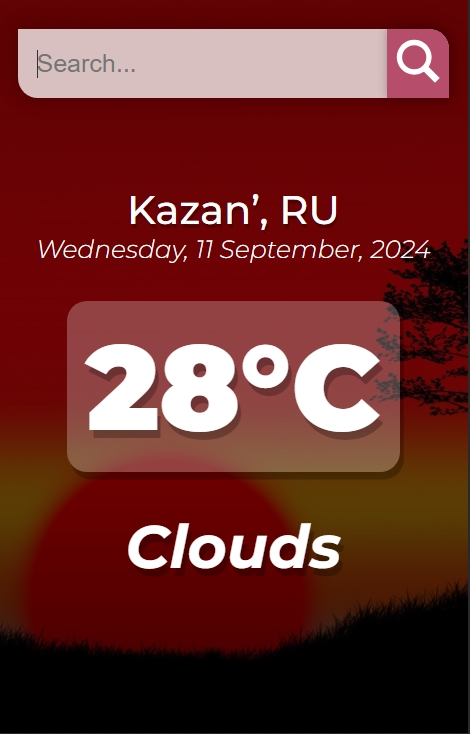
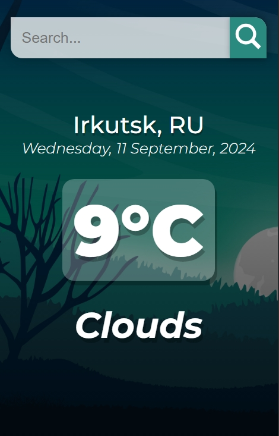

# 🔆 Приложение для отслеживания погоды
Сайт для поиска текущей погоды по названию города с адаптивным интерфейсом и обработкой ошибок ввода.

## 🛠️ Стек технологий


## 🔌 API
Источник данных о погоде - [OpenWeatherMap API](https://openweathermap.org/).

## 🌐 Демо
Ознакомиться с приложением можно [здесь](https://afkeomre.github.io/weather/).

## ✔️  Особенности  
- **Функционал поиска**: приложение позволяет пользователям вводить название города для поиска текущих погодных условий.
- **Отображение погоды**: отображает текущую температуру, погодные условия, местоположение и дату.
- **Обработка ошибок**:  выводит сообщение об ошибке, если местоположение не может быть найдено.
- **Динамические темы**: веб-сайт автоматически меняет фоновое изображение и цвет кнопок в зависимости от температуры. Существует две темы: "холодная" для низких температур и "теплая" для высоких.
- **Адаптивный дизайн**: интерфейс адаптируется к различным размерам экрана, обеспечивая удобство работы как на десктопах, так и на мобильных устройствах.

## 🖼️ Интерфейс

### 🖥️ Десктоп
|  |  |
|:--:|:--:|
| Главный экран | Теплая тема |

|  |  |
|:--:|:--:|
| Холодная тема | Сообщение об ошибке |


### 📱 Мобильные устройства
|  |  |  |  |
|:--:|:--:|:--:|:--:|
| Главный экран | Теплая тема | Холодная тема | Сообщение об ошибке |


## ⚙️ Настройка проекта
### Установка зависимостей
```
npm install
```

### Компиляция и горячая перезагрузка для разработки
```
npm run serve
```

### Компиляция и минификация для продакшена
```
npm run build
```
